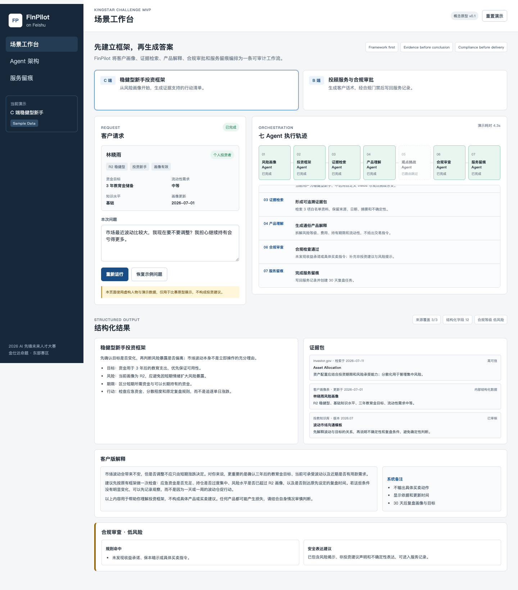
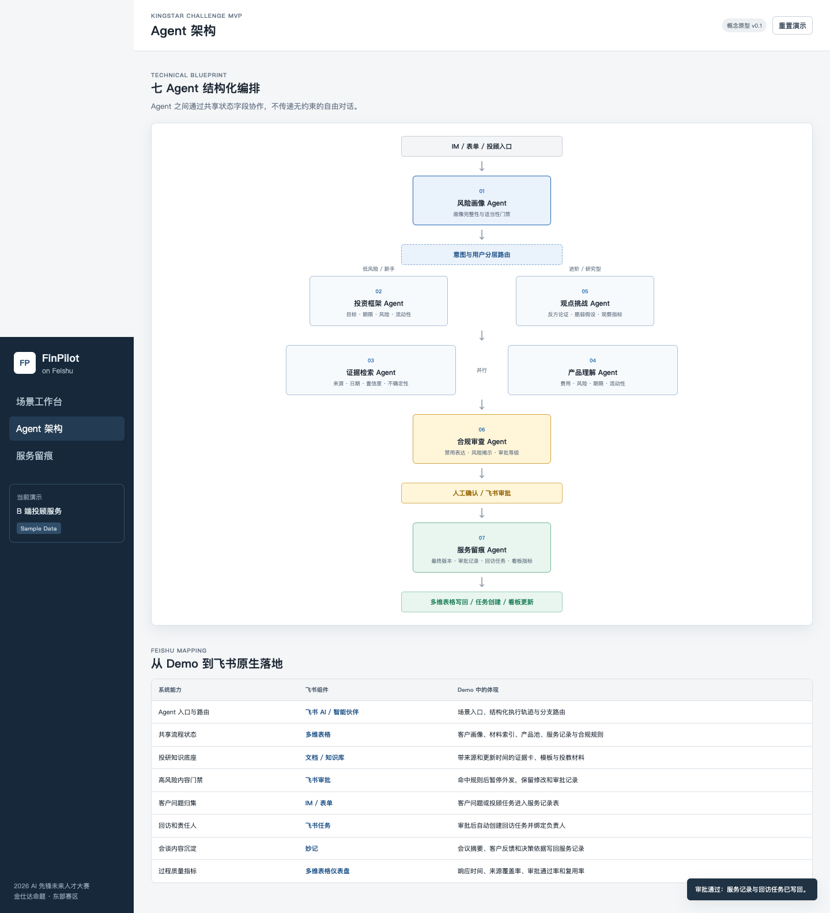
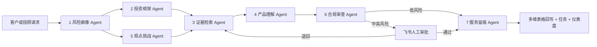

# FinPilot on Feishu

面向中小金融机构与个人投资者的可解释、可合规、可追溯金融投研与财富服务助手。

本仓库是「2026 AI 先锋未来人才大赛」金仕达命题的可交互 MVP。它不做自动荐股，而是把金融服务拆成一条可审计的工作流：**先理解用户，再组织证据；先完成合规审查，再对外服务。**

> 所有人物、客户、产品与数据均为比赛演示样例。本系统不构成投资建议，也不执行任何交易。

## Prototype Preview

### C 端：保守型新手的市场波动陪伴



### 7-Agent 编排与执行轨迹



## What the MVP Proves

- C 端用户先获得「目标、风险、期限、流动性」框架，再理解产品与市场信息。
- B 端投顾获得证据包、服务话术、合规改写、人工审批与留痕闭环。
- 7 个 Agent 通过结构化共享状态协作，不依赖不可审计的自由聊天传递。
- 每项能力都映射到飞书 AI、多维表格、知识库、审批、任务和仪表盘。
- 高风险内容在人工审批前无法进入对客交付状态。

## Seven-Agent Orchestration



| Agent | 核心职责 | 关键输出 |
|---|---|---|
| 风险画像 | 校验画像完整度与时效性 | 风险等级、缺失字段、适当性状态 |
| 投资框架 | 先建立决策框架 | 目标、风险、期限、流动性清单 |
| 证据检索 | 汇总并标注外部证据 | 来源、日期、摘要、置信度、不确定性 |
| 产品理解 | 把复杂产品翻译为分层解释 | 新手版、投顾版、风险揭示清单 |
| 观点挑战 | 主动寻找反证和脆弱假设 | 反方观点、监测指标、触发条件 |
| 合规审查 | 检测禁用表达与信息缺口 | 命中规则、改写版本、审批级别 |
| 服务留痕 | 固化最终内容和责任链 | 服务记录、审批记录、跟进任务、指标 |

完整字段契约与两条黄金路径见 [MVP 产品规格](docs/PRODUCT_SPEC.md)。

## Feishu-Native Mapping

| 业务能力 | 飞书组件 | MVP 中的表现 |
|---|---|---|
| Agent 入口与路由 | 飞书 AI / 智能伙伴 | 场景选择、任务运行、Agent 轨迹 |
| 结构化共享状态 | 多维表格 | 用户、证据、产品、规则、服务记录 |
| 可信投研知识 | 云文档 / 知识库 | 带来源与时间戳的证据卡片 |
| 合规人审关口 | 审批 | 待审、通过、退回状态与责任人 |
| 客户需求采集 | IM / 表单 | 预填问题与服务上下文 |
| 跟进闭环 | 任务 | 自动生成复盘和客户跟进任务 |
| 经营度量 | 多维表格仪表盘 | 来源覆盖率、审批率、响应时长 |

## Run Locally

这是一个零依赖静态网站。直接打开 `index.html` 即可体验，也可以在仓库目录启动任意静态文件服务。

```bash
python3 -m http.server 8080
```

然后访问 `http://localhost:8080`。

## Deploy to Zeabur

1. 在 Zeabur 项目中选择 `Deploy New Service`。
2. 选择 `GitHub`，授权后选择 `pablopeng/finpilot-on-feishu`。
3. 保持默认配置并点击部署。
4. 部署成功后，在 `Domains` 中生成免费域名。

仓库根目录只包含静态文件，Zeabur 会自动使用静态站点模式，无需构建命令、启动命令或环境变量。

## Competition Scope

当前 MVP 聚焦产品逻辑与飞书编排，暂不接入真实行情、真实客户数据、生产模型密钥或交易执行能力。后续在赛事租户中，可将演示层逐步替换为飞书多维表格、知识库、审批和智能伙伴的真实能力。

